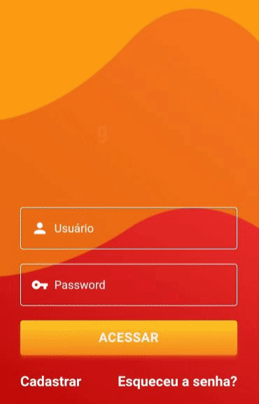

[![Contributors][contributors-shield]][contributors-url]
[![LinkedIn-FrontEnd][linkedin-shield]][linkedin-url-1]
[![LinkedIn-BackEnd][linkedin-shield]][linkedin-url-2]
[![LinkedIn-Designer][linkedin-shield]][linkedin-url-3]

<!-- PROJECT LOGO -->
<br />
<p align="center">
  <a href="https://github.com/Toshiuk/r5go-b2w-front">
  
</a>
  <p align="center">
    Buy your products in <a href="https://www.americanas.com.br/">Americanas</a> just scanning then.
    <br />
    <br />
    <a href="https://github.com/Toshiuk/r5go-b2w-front">View Demo</a>
  </p>
</p>

<!-- TABLE OF CONTENTS -->

## Table of Contents

- [About the Project](#about-the-project)
  - [Built With](#built-with)
- [Getting Started](#getting-started)
  - [Prerequisites](#prerequisites)
  - [Running](#running)

<!-- ABOUT THE PROJECT -->

## About The Project

This project was made as a solution of Mega Hack 2.0 Americanas/B2W.

 <p align="center">

</p>

### Built With

- [React](https://reactjs.org/)

<!-- GETTING STARTED -->

## Getting Started

### Prerequisites

- yarn

### Running

1. Clone the repo

```sh
git clone https://github.com/Toshiuk/r5go-b2w-front.git
```

2. Install NPM packages

```sh
yarn install
```

3. Run development mode

```sh
yarn dev
```

<!-- MARKDOWN LINKS & IMAGES -->

[contributors-shield]: https://img.shields.io/github/contributors/Toshiuk/r5go-b2w-front.svg?style=flat-square
[contributors-url]: https://github.com/Toshiuk/r5go-b2w-front/graphs/contributors
[linkedin-shield]: https://img.shields.io/badge/-LinkedIn-black.svg?style=flat-square&logo=linkedin&colorB=555
[linkedin-url-1]: https://linkedin.com/in/flaviotoshiukhjr
[linkedin-url-2]: https://linkedin.com/in/pablocampina
[linkedin-url-3]: https://linkedin.com/in/1mauriliosouza
